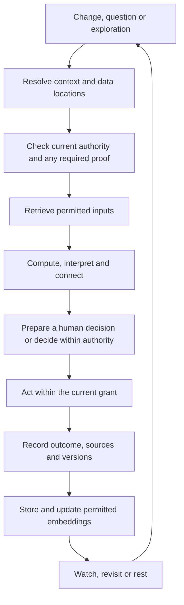

# Aura agent and data development plan

Design baseline: 25 September 2026. This is a proposed development programme, not a claim that the agent runtime, secure vault, encryption or zero-knowledge proofs are implemented.

Prototype update, 26 September 2026: a separate [Vector Space page](https://auraofintelligence.github.io/aura-matrix-studio/?page=aura-vector-space) now tests text imports, selectable local word-pattern algorithms, numerical vectors, a PCA display layout, seven nested tori, a geosphere and traceable geometry associations. It is accessed from Enter the Matrix and does not integrate with or modify existing Aura records. See the [README](README.md#experimental-vector-space) for its limits. This implements an exploratory slice of the shared-volume design described in *Blend Aura to Unity* and page 8 of *Version7 Aura of Intelligence 2023 July*, rather than claiming the full ML or security architecture is complete.

## Purpose

Develop Aura as a personal interface through which many small AI agents and ordinary software routines retrieve, place, connect and interpret information; prepare or make authorised decisions; act; and record what happened. Their work spans seven dual-surface horn tori and a dual-sided geosphere, within one chakra or across several.

Agents can maintain ongoing responsibilities without running model inference constantly. Use events, schedules and changed dependencies to wake the right work. Run independent tasks together and dependent tasks in sequence, with shared context and explicit compute budgets.

The current browser edition supplies interfaces, records, geometry and local persistence. It is not a secure vault or an autonomous agent service. See the [README](README.md) for current capabilities and limitations.

## Keep these decisions separate

| Concern | Design principle |
| --- | --- |
| Geometry | Preserve the fixed 12 x 24 torus address model. Facets, edges, vertices, rays and stacks provide stable spatial references. Give records their own stable IDs and versions. |
| Meaning | Chakra associations are editable philosophical perspectives. A record can participate in several contexts without being copied or repeatedly entered. |
| Surface | Inside and outside express how information is presented. Moving a record or switching surfaces must not silently publish it or change its permissions. |
| Location | Record where originals, replicas, backups, caches, embeddings and outputs live, and where computation occurs. |
| Authority | Specify who or what may perform which actions on which information, for how long and under what conditions. |
| Execution | Select code, a small local model, a larger model or a human decision according to the task, permitted data movement and budget. No model vendor is required. |

Capture information once, reuse it in context and leave room for the person's own words. Keep new questions and controls concise. A facet can develop richer associations over time; it is not restricted to one word or one agent.

## A repeatable design cycle

1. **Choose a real outcome.** Describe the situation, useful result, acceptable autonomy and what should remain the person's decision. Include planned activity and room for serendipity.
2. **Map the information.** Identify existing records, missing inputs, sources, freshness and uncertainty. Specify storage, execution locations, encryption and disclosure before connecting tools.
3. **Choose contributing perspectives.** Start in one chakra and bring in others only where they add useful context. Explore deeper, wider, across categories, back through experience or forward through scenarios.
4. **Define agents and handoffs.** Specify triggers, permitted inputs and actions, outputs, dependencies, resource limits, escalation and stopping conditions.
5. **Prototype a complete journey.** Follow information from intake through a decision or action to its outcome and reusable memory. Start with synthetic records and simulated external actions.
6. **Test boundaries and failure.** Include stale evidence, conflicting advice, unavailable devices, revoked authority, interrupted work and repeated requests.
7. **Review and reuse.** Measure usefulness, interruptions, repeated questions, compute and outcomes. Keep successful patterns; revise context and embeddings when their sources change.

Each cycle produces a short scenario, information/access map, agent contracts, workflow, visual prototype and test results. These are implementation checkpoints, not extra forms for the person to complete.

## Working within and across chakras

These are starting associations, not fixed classifications or scientific claims.

| Perspective | Example contribution to a travel decision |
| --- | --- |
| Root | Resources, accommodation and practical readiness |
| Sacral | Enjoyment, curiosity and creative experiences |
| Solar plexus | Intentions, priorities and commitments |
| Heart | Family, friendships, belonging and reciprocity |
| Throat | Communication, applications and expression |
| Third eye | Evidence, patterns, alternatives and reflection |
| Crown | Meaning, long horizons and celestial cycles |
| Geosphere | Spatial context, places and Earth/celestial views |

A single-chakra task can remain local to its context. Cross-chakra work references the same authorised records and adds perspectives, rather than creating seven copies. Celestial calculations, seasonal observations and personal astrological interpretations retain distinct evidence types. Linking contexts grants no additional access.

## Agent contracts and coordination

Every agent contract names its purpose, trigger, input references, permitted tools, execution location, output destination, evidence requirements, autonomy, budget and stop/ask conditions. Grants distinguish reading, computing, appending, editing, disclosing, delegating and executing external actions.

The shared runtime cycle is:

Use a durable queue and dependency graph. Independent research can run concurrently; applications wait for their required evidence and authority. Check permissions again at disclosure and action time. Prevent duplicated actions on retries, cancel obsolete work and detect stale versions before overwriting records.

Keep observations, inferences, proposals, decisions and confirmed outcomes distinguishable. Embeddings support retrieval; the underlying records remain the source of truth. Record why an association changed. Recompute only affected dependencies, with limits on agent loops and a separate allowance for exploratory work. Lightweight checks should wake models only when interpretation is needed.

## Encryption, location and personal authority

Internal facets should default to access on explicitly trusted devices. Outside facets can default to public-facing presentation. People may instead open internal records, encrypt selected external stacks, publish everything or choose mixed arrangements. Public reading does not automatically permit writing or execution. An internet-hosted encrypted record is not automatically public plaintext.

For each independently shareable record or field, the design must account for:

- **Storage and computation:** approved devices/services, replicas, retention, offline behaviour and whether plaintext may leave a device.
- **Encryption and keys:** authenticated encryption, appropriate nonce handling, protected key storage, recovery, rotation and who can decrypt. Use reviewed libraries and protocols rather than inventing cryptography.
- **Access:** people, agents and devices; exact actions and scope; expiry, delegation limits and revocation. A deterministic permission service enforces grants. AI can explain or propose a change, but cannot award itself authority.
- **Derived information:** summaries, embeddings, logs and combined outputs retain source restrictions unless an explicit disclosure rule permits release. Exposing selected fields must not release a key for the entire private record.
- **Changes:** version policies and record moves. Revocation stops future authorised access; it cannot recall plaintext or keys already copied by a recipient.

Encryption at rest does not protect information from a compromised application while it is decrypted. The current shared-origin GitHub Pages storage must not be presented as the trusted-device security boundary. Design the vault, runtime isolation, key recovery and synchronisation separately before using sensitive real data.

## Where optional zero-knowledge proofs fit

Use a ZKP when a precise claim can replace disclosure of underlying information. Do not require one for every interaction or for intentionally public records.

| Situation | Potential proof | What it does not establish |
| --- | --- | --- |
| Access to a restricted stack | Membership of an authorised group without revealing the member's identity | Unlimited access or permission to edit |
| Eligibility check | A required attribute or threshold is satisfied by a trusted credential | The truth of an unsupported self-entered claim |
| Agreed calculation | A specified program produced a result from a committed input snapshot | That the program is useful, fair or based on accurate evidence |

Bind proofs to the intended request, resource, action and recipient/session. Verify against current authenticated policy state; reject expired grants and replayed challenges. Plan proof generation cost and what remains visible in metadata. Proofs complement encryption and permissions; they do not encrypt a remote model's prompt or hide inputs from the party generating the proof. Blockchain is not required.

Choose the proof system only after defining the first predicate, credential issuer, trust assumptions and threat model. Production use requires specialist cryptographic review.

## Travel Oracle as the first cross-chakra study

Use these related projects as design seeds, not as an already integrated or running agent system:

- [Australian World Travel](https://github.com/auraofintelligence/Australian-world-travel): routes, documents and practical planning.
- [Australian Visa Activity Atlas](https://github.com/auraofintelligence/Australian-visa-activity-atlas): entry and activity requirements with dated sources.
- [Global Founder Atlas](https://github.com/auraofintelligence/global-founder-atlas): project, research and founder opportunities.
- [Strange But True Travel Oracle](https://github.com/auraofintelligence/strange-but-true-travel-oracle): exploration, synthesis and agent-role experiments.

The supplied Travel Oracle, dynamic travel intelligence, chaos itinerary and peace-through-travel documents provide concept history. Their old dates, numerical targets and claims are not current requirements or verified advice. Destination count and planning horizon remain configurable.

Prototype an invitation journey: gather permitted dates and interests; research logistics and opportunities in parallel; compare sourced options; prepare a decision; assemble any required application; act only within the person's grant; record the actual result. Personal decision material can remain local while a separately authorised subset supports an application. Nearby Opportunities remains an undefined extension point until its intended behaviour is specified.

## Delivery stages and acceptance checks

| Stage | Deliverable and exit condition |
| --- | --- |
| 1. Contracts and replay | Shared record, policy and agent contracts; replay a birthday task and a travel scenario using synthetic data. No repeated questions or hidden data copies. |
| 2. Vault and authority | Trusted-device boundary, key recovery, location rules and permission enforcement. Test allowed and denied operations, public openness, expiry, revocation and restore. |
| 3. Local agent loop | One useful task from trigger to recorded outcome. Failure, retries and changed inputs do not duplicate actions or widen permissions. |
| 4. Cross-chakra collaboration | Parallel research and sequential handoffs reuse context, preserve provenance and respect compute limits. Show why a decision was prepared or made. |
| 5. Optional proof | Demonstrate one narrow ZKP claim. Reject wrong scope, stale policy and replay; document assumptions, metadata and measured cost. |
| 6. Authorised extensions | Connect chosen software/hardware services; test offline recovery, cancellation, disclosure and action boundaries. Obtain security review before sensitive deployment. |

At every stage, show the person what is working, waiting or needs a decision without filling the interface with controls. Test that moving between facets, stacks, chakras or surfaces cannot expand authority, and that a model error cannot bypass enforcement. Record remaining limitations alongside each completed milestone.
